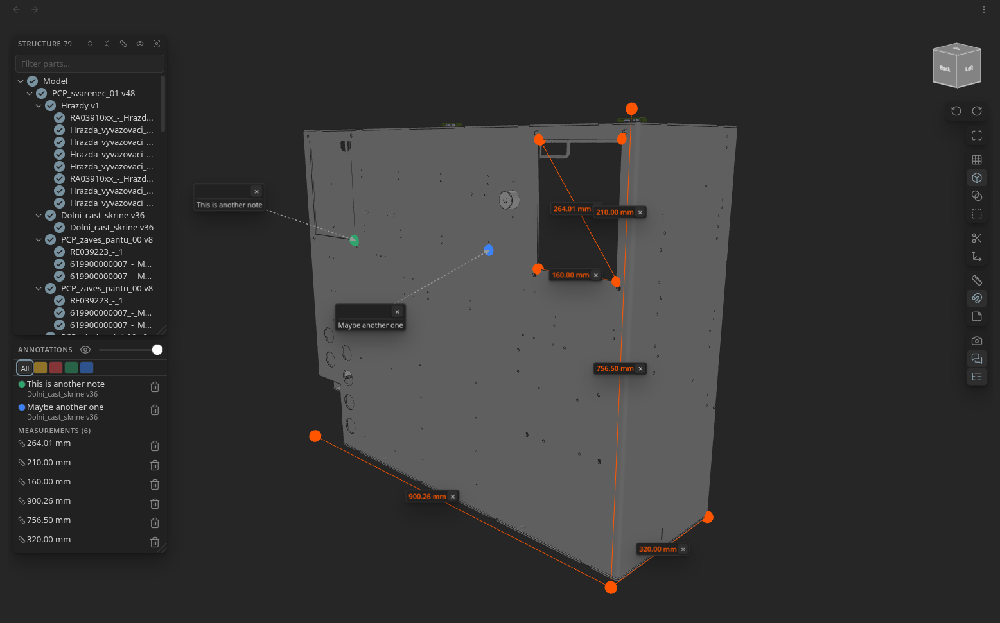
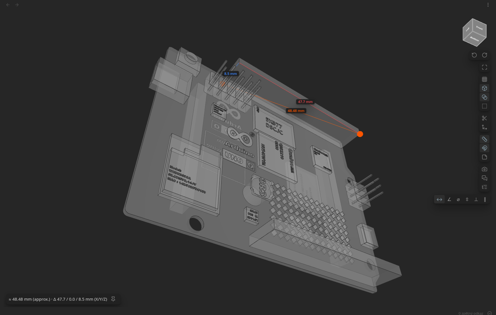
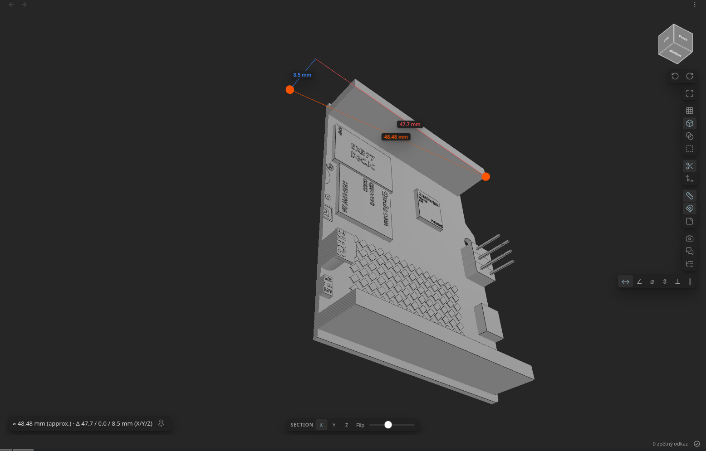
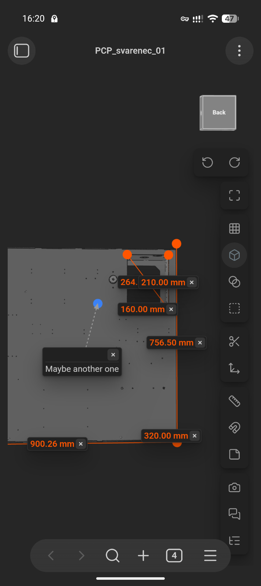

# STEP Viewer for Obsidian

View CAD models directly inside Obsidian in an interactive 3D viewer. Click a
supported file in the file explorer and it opens in a
[`three.js`](https://threejs.org/)-powered viewer with orbit / pan / zoom, model
colours, edges, measurement, annotations and a navigation cube — or embed a
model inline in any note.

**Supported formats:**

- **STEP** (`.step` / `.stp`) — full B-rep parsing with assembly hierarchy and
  per-face colours.
- **FreeCAD** (`.FCStd`) — native FreeCAD documents; the visible objects are
  rendered with their placements and colours.
- **OBJ** / **STL** — plain triangle meshes.

Geometry parsing is done with
[`occt-import-js`](https://www.npmjs.com/package/occt-import-js) (OpenCASCADE
compiled to WASM), which reads both STEP and the BREP shapes stored inside
FreeCAD documents.

[](https://ko-fi.com/B7K822EW68)

> **Mobile support (beta).** The plugin also runs on Obsidian mobile: the
> layout adapts to small touchscreens and orbit / pan / pinch-zoom work with
> touch (tap a part to see its info). Because the WASM parser can run out of
> memory on large models in the mobile webview, opening a large file first
> shows a warning you can dismiss to continue.

## Screenshots









## Install

Install from the Obsidian **Community Plugins** browser (search for "STEP
Viewer"), or install manually:

Download `main.js`, `manifest.json` and `styles.css` from the
[latest release](https://github.com/ondreu/step-viewer/releases/latest) into
`<vault>/.obsidian/plugins/step-viewer/`, then enable the plugin.

## Features

- **Open CAD files straight from the file explorer** — `.step` / `.stp`,
  **`.FCStd`** FreeCAD documents, and **`.obj` / `.stl`** triangle meshes.
- **FreeCAD documents** — a `.FCStd` file is a ZIP of native BREP shapes; the
  plugin unzips it, renders every object that is **visible** in FreeCAD, applies
  each object's placement, and colours it from its FreeCAD **shape colour**.
  Sketches, datums and hidden construction features are skipped.
- **Export** the selected part (or the whole model) as an `.obj` mesh.
- **3D rendering** with `three.js`: orbit / pan / zoom, per-face colours from
  the model (default material otherwise), edge display, and auto-fit on load.
- **Navigation cube** (top-right) that tracks the camera — click a face to snap
  to a standard view (front / back / top / bottom / left / right), with
  **↶ / ↷ arrows** that animate a 90° roll.
- **Wireframe** and **transparency** toggles (transparency reveals internals).
  Right-click a part to swap it between solid and transparent on its own.
- **Perspective / orthographic** projection toggle (orthographic is often better
  for judging CAD proportions).
- **Section plane** — a movable clipping plane (X / Y / Z axis, flip side, and a
  position slider) that cuts into the model to inspect internal dimensions. The
  cut face is filled with a hatch pattern (stencil cap) so cut solids read as
  solid rather than hollow.
- **Explode view** — a slider that spreads an assembly's top-level parts outward
  from its centre.
- **Isolate** — hide everything except the selected part; annotations and
  measurements anchored outside that part are hidden with it.
- **Hover / selection info** — the part under the cursor is highlighted and an
  info panel (bottom-right) shows its name, assembly path, **material** (read
  from the STEP metadata when present), bounding-box size, approximate **volume
  and surface area**, colour swatch and triangle count; the matching node is
  revealed in the structure tree. **Clicking** a part pins its info card so it
  stays shown when the cursor moves away.
- **Structure tree** — the assembly hierarchy, with per-part visibility
  toggles and click-to-frame. The panel is **resizable** (drag the corner grip),
  the expand / collapse buttons step **one level at a time** across the whole
  tree, and an **auto-measure** button pins the selected part's (or the whole
  model's) bounding-box L × W × H as measurements in one click.
- **Measurement types** — choose from a strip below the ruler button:
  - **Distance** — two points: straight-line distance **plus per-axis X / Y / Z
    components**, as colour-coded legs and numbers beside each line.
  - **Angle** — three points (the corner is the 2nd).
  - **Radius / diameter** — three points around a circular edge (circle fit).
  - **Thickness** — a point on a face; a ray through the solid finds the far side.
  - **Point → face** — perpendicular distance from a point to a face's plane.
  - **Face → face** — distance between two faces along the first face's normal.
- **Pinned measurements** — press the 📌 **pin** button in the readout to keep a
  measurement. Pinned measurements are parented to the model (so they follow
  rolls) and are saved per file; each has a distance label with a delete button.
  They're also listed in the annotations panel (click a row to fly to it), and
  their end markers **scale with zoom** so they stay a constant on-screen size.
- **Snap to corners / edges** — the magnet toggle snaps both measurement and
  annotation picks to the nearest visible vertex/edge, with a live preview
  marker (green when snapping, orange when free).
- **Annotations** — pin editable notes to points on the model; they follow the
  part through rolls and are saved per file. Their anchor pins **scale with
  zoom** to stay a constant on-screen size. An annotations list panel lists each
  note (and the pinned measurements) with a show/hide toggle — which hides notes
  **and** measurements together — and an opacity slider that fades the notes,
  their anchor pins and their leader arrows. Each note has per-note controls:
  - **Hover-only** — collapse the note to a dot and reveal the text on hover.
  - **Leader** — **drag a note off the model** (or use the leader button) to
    pull it out to the side; a dashed line with an arrowhead points back to its
    anchor. Drag again to reposition; the leader button snaps it back.
  - **Category colour** — a swatch opens a palette of presets
    (Note / Issue / OK / Info) **plus a custom colour picker** for any colour;
    the list panel can filter by category. You can also recolour a note straight
    from the list by **clicking its colour dot**.
  - **Markdown** — note text renders as Markdown in read state (click to edit).
  - **Link** — attach an Obsidian note (wikilink); a ↗ chip opens it.
- **Screenshot** — capture the current view (model + measurement/note captions)
  as a PNG saved next to the model, with an embed link copied to the clipboard.
- **Adaptive quality** — mesh detail is reduced automatically as files grow
  (configurable in settings), and parsed geometry of large models is cached
  off-vault so reopening them is near-instant.
- **Note embeds** — render a model inline in any note (see below).

> **Measurement and annotations are approximate.** They run against the
> tessellated mesh, not the exact B-rep geometry, so readings are close to — but
> not exactly — the true CAD dimensions. The measurement readout is labelled
> `(approx.)` accordingly.

## Usage

Open any supported file from the file explorer. The toolbar (top-right,
below the navigation cube) provides:

| Button | Action |
| --- | --- |
| Fit | Reset / fit the camera to the model |
| Wireframe | Toggle wireframe rendering |
| Edges | Toggle edge display |
| Transparency | Make surfaces translucent to see inside |
| Projection | Switch perspective ↔ orthographic |
| Section | Show the clipping-plane control (axis / flip / position) |
| Explode | Show the explode slider |
| Measure | Enable measuring; pick a type from the strip that appears |
| Snap | Snap measurement/annotation picks to corners & edges |
| Annotate | Click a point to pin an editable note |
| Screenshot | Save a PNG of the current view next to the model |
| Annotations | Open the annotations list panel |
| Structure | Open the assembly structure tree |

The buttons are split into separate cards by group (framing · appearance ·
inspect · measure/annotate · output/panels). The ↶ / ↷ arrows below the cube
roll the view; clicking a **cube face** first undoes any roll so the view snaps
to a clean, upright standard view.

Hovering a part in the model highlights it; **clicking** a part selects it (the
highlight sticks, and its info card stays pinned) and reveals it in the
structure tree — hovering never scrolls the tree. In the **structure tree**,
hover a row to highlight that part in 3D, click it to select and frame it, and
use the header controls to expand/collapse **one level at a time**, toggle all
visibility, auto-measure the selection's bounding box, filter by name, or
**isolate** the selection. Drag the panel's bottom-right grip to resize it.

### Embedding a model in a note

````markdown
```step
path: Models/bracket.step
height: 320
view: front          # optional: front/back/left/right/top/bottom/iso
rotate: 90           # optional: initial roll in degrees (or `roll: 1` in quarter turns)
annotations: false   # optional: hide saved notes in this embed (default true)
quality: detailed    # optional: fastest/balanced/detailed, or a coarseness like 0.01
```
````

`path` accepts a wikilink target (`[[bracket.step]]`) or a vault-relative path;
`height` is optional (pixels, default 400). Each embed mounts its own viewer
when it scrolls into view and is disposed when it scrolls away, so a note with
many embeds doesn't exhaust the browser's limited WebGL contexts.

Annotations **and pinned measurements** are keyed by file path, so notes and
measurements added in the full view also appear in embeds of the same model, and
vice versa.

## Settings

- **Performance profile** — how aggressively mesh detail is reduced as files
  grow (Fastest / Balanced / Detailed), with an advanced size → coarseness table
  for fine control.
- **Reconstruct missing faces** — rebuild flat faces the STEP reader couldn't
  tessellate so they render solid (see Troubleshooting). On by default.
- **Cache** — parsed geometry of large models (≥ 15 MB) is cached off-vault
  (IndexedDB, never synced) so reopening is near-instant; the cache size cap is
  configurable and it can be cleared from settings.

## Troubleshooting

**Some surfaces render as hollow "frames" (you can see through them).** A few
STEP files describe faces the geometry kernel can't tessellate — the surface
comes back with no interior triangles, so it renders as just its outline (the
reader, `occt-import-js`, does no shape healing).

The plugin **reconstructs these planar faces automatically**: it caps the open
boundary loops of the affected parts, preserving holes and cutouts, so they
render solid. This is on by default (Settings → *Reconstruct missing faces*)
and only ever touches parts that are otherwise invisible.

Reconstruction handles flat faces. For anything it can't rebuild (curved faces),
the plugin shows a notice listing the parts; re-export the file through a
healing tool — opening it in **FreeCAD** and exporting again (as STEP, or as
`.obj` / `.stl`, which this plugin reads) rebuilds all faces cleanly.

**A FreeCAD model looks empty or is missing parts.** Only objects that are
**visible** when the document was last saved in FreeCAD are rendered, and only
objects that carry solid/surface geometry (sketches and datums are skipped). Make
the parts you want visible in FreeCAD, save, and reopen. Assembly features that
rely on FreeCAD's own solver (e.g. some `App::Link` / assembly workbench setups)
may not carry standalone shapes; exporting such a document to STEP is the most
reliable route.

## Development

```bash
npm install
npm run build     # type-checks and bundles a self-contained main.js
npm run dev       # esbuild watch mode
```

The build inlines `occt-import-js.wasm` into `main.js` (gzipped, inflated at
runtime), so no separate WASM file ships.

### Cutting a release

Bump the version in `manifest.json`, `package.json` and `versions.json`, commit,
then push a matching tag (no `v` prefix):

```bash
git tag 1.13.0 && git push origin 1.13.0
```

`.github/workflows/release.yml` builds and publishes a GitHub release with the
plugin assets (`main.js`, `manifest.json`, `styles.css`).

## Architecture

Source lives in `src/`:

```
main.ts                     Plugin: registers view, extensions, embed processor
view/StepView.ts            FileView: file lifecycle, owns the viewer
embed/StepEmbed.ts          `step` code-block embed (lazy mount/dispose)
viewer/mountViewer.ts       Builds the full viewer + UI (shared by view & embed)
viewer/OcctLoader.ts        Lazy singleton over the inlined occt-import-js WASM
viewer/occt.worker.ts       Off-main-thread STEP/BREP parse (Web Worker)
viewer/StepToThree.ts       occt result JSON -> THREE.Group + structure tree
viewer/MeshLoaders.ts       OBJ / STL parsing into the viewer model
viewer/FreeCadLoader.ts     .FCStd unzip + Document/GuiDocument.xml + BREP shapes
viewer/GeometryCache.ts     Off-vault (IndexedDB) parsed-geometry cache
viewer/HealFaces.ts         Reconstruct untessellated planar faces
viewer/ViewerController.ts  Scene, camera, controls, picking, measure, dispose
viewer/fitCamera.ts         Camera fit to bounding box
viewer/params.ts            Tessellation parameters by file size
ui/Toolbar.ts               Toolbar buttons + measurement-type strip
ui/ViewCube.ts              Navigation cube
ui/ViewControls.ts          Floating section + explode controls
ui/TreePanel.ts             Structure-tree panel (select / frame / isolate)
ui/PartInfoPanel.ts         Hover info panel
ui/LabelLayer.ts            Projected HTML labels + leader lines (screenshot draw)
ui/AnnotationLayer.ts       Annotation pins + notes (markdown / link / colour)
ui/AnnotationsPanel.ts      Annotations list panel (hide / opacity / filter)
ui/MeasurementLayer.ts      Pinned (persistent) measurements
annotations/AnnotationStore.ts  Per-file annotation persistence (plugin data)
annotations/MeasurementStore.ts Per-file pinned-measurement persistence
annotations/pluginData.ts   Serialized read-modify-write of data.json
types.ts, occt-import-js.d.ts   occt typings + result shape
```

Each open view (and embed) owns a WebGL context and disposes it on close
(`renderer.dispose()` + `forceContextLoss()`), which is essential to avoid
exhausting the browser's limited context pool.

## License

MIT (this plugin). `occt-import-js` / OpenCASCADE is **LGPL-2.1**; the bundled
`occt-import-js.wasm` is distributed under that licence (see
`node_modules/occt-import-js/dist/license.*.txt`).
